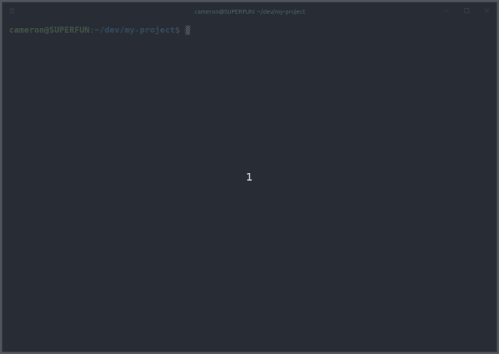

## **pgsh**: PostgreSQL tools for local development

  

Finding database migrations painful to work with? Switching contexts a chore? [Pull requests](docs/pull-requests.md) piling up? `pgsh` helps by managing a connection string in your `.env` file and allows you to [branch your database](docs/branching.md) just like you branch with git.

---

## Prerequisites
There are only a couple requirements:

* your project reads its database configuration from the environment
* it uses a `.env` file to do so in development.

> See [dotenv](https://www.npmjs.com/package/dotenv) for more details, and [The Twelve-Factor App](https://12factor.net) for why this is a best practice.

| Language / Framework | `.env` solution | Maturity |
| -------------------- | --------------- | -------- |
| javascript | [dotenv](https://www.npmjs.com/package/dotenv) | high |
| python (django) | [django-dotenv](https://github.com/jpadilla/django-dotenv) | unknown |

pgsh can help even more if you use [knex](https://knexjs.org) for migrations.

## Installation

1. `yarn global add pgsh` to make the `pgsh` command available everywhere
2. `pgsh init` to create a `.pgshrc` config file in your project folder, beside your `.env` file (see `src/pgshrc/default.js` for futher configuration)
3. You can now run `pgsh` anywhere in your project directory (try `pgsh -a`!)
4. It is recommended to check your `.pgshrc` into version control. [Why?](docs/pgshrc.md)

## URL vs split mode
There are two different ways pgsh can help you manage your current connection (`mode` in `.pgshrc`):
* `url` (default) when one variable in your `.env` has your full database connection string (e.g. `DATABASE_URL=postgres://...`)
* `split` when your `.env` has different keys (e.g. `PG_HOST=localhost`, `PG_DATABASE=myapp`, ...)

---

## Command reference

* `pgsh init` generates a `.pgshrc` file for your project.
* `pgsh url` prints your connection string.
* `pgsh psql <name?> -- <psql-options...?>` connects to the current (or *name*d) database with psql
* `pgsh current` prints the name of the database that your connection string refers to right now.
* `pgsh` or `pgsh list <filter?>` prints all databases, filtered by an optional filter. Output is similar to `git branch`. By adding the `-a` option you can see migration status too!

## Database branching

Read up on the recommended [branching model](docs/branching.md) for more details.

* `pgsh clone <from?> <name>` clones your current (or the `from`) database as *name*, then (optionally) runs `switch <name>`.
* `pgsh create <name>` creates an empty database, then runs `switch <name>` and optionally migrates it to the latest version.
* `pgsh switch <name>` makes *name* your current database, changing the connection string.
* `pgsh destroy <name>` destroys the given database. *This cannot be undone.* You can maintain a blacklist of databases to protect from this command in `.pgshrc`

## Dump and restore

* `pgsh dump <name?>` dumps the current database (or the *name*d one if given) to stdout
* `pgsh restore <name>` restores a previously-dumped database as *name* from stdin

## Migration management (via knex)

pgsh provides a slightly-more-user-friendly interface to knex's [migration system](https://knexjs.org/#Migrations).

* `pgsh up` migrates the current database to the latest version found in your migration directory.

* `pgsh down <version>` down-migrates the current database to *version*. Requires your migrations to have `down` edges!

* `pgsh force-up` re-writes the `knex_migrations` table *entirely* based on your migration directory. In effect, running this command is saying to knex "trust me, the database has the structure you expect".

* `pgsh force-down <version>` re-writes the `knex_migrations` table to not include the record of any migration past the given *version*. Use this command when you manually un-migrated some migations (e.g. a bad migration or when you are trying to undo a migration with missing "down sql").

* `pgsh validate` compares the `knex_migrations` table to the configured migrations directory and reports any inconsistencies between the two.
